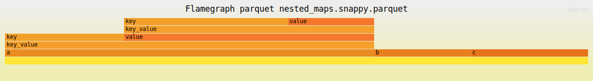

# Parquet flamegraph

`parquet-flamegraph` is a small tool for generating flamegraphs to investigate parquet file storage.

It helps to identify which columns take up the most storage in a parquet file.

The result is a flamegraph like the following: 

Hovering over the fields will show the exact number of bytes used by each column. (You will need to open the file in a browser.)

# Installation

Currently, the only installation method available is through the Rust toolchain. You can install it with the following command:

`cargo install parquet-flamegraph`

